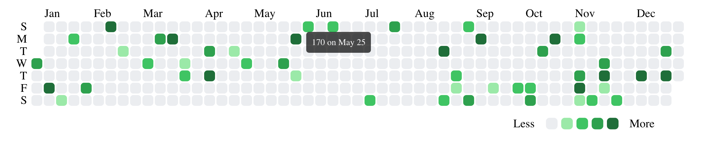

# githubCalendar
Creating a custom visual in Observable, then turning it into an htmlwidget to be used in R! All the user needs to do is supply their own data!


## Install the library
```
devtools::install_github("MayaGans/githubCalendar")
```

## Run the `githubCalendar` function on your data

```
# dates must be Date type
dates <- sample(seq(as.Date('2020-01-01'), as.Date('2020-12-31'), by="day"), 50)
values <- abs(round(rnorm(50, 100, 100), 0))
githubCalendar(dates = dates, values = values)

```



## Add a dynamic Calendar to your shiny app

```
library(shiny)

githubData <- tidyr::tibble(
    all_dates = c(sample(seq(as.Date('2018/01/01'), as.Date('2019/01/01'), by="day"), 50),
                  sample(seq(as.Date('2019/01/01'), as.Date('2020/01/01'), by="day"), 100),
                  sample(seq(as.Date('2020/01/01'), as.Date('2021/01/01'), by="day"), 200)
    ),
    all_values = abs(round(rnorm(350, 100, 100), 0))
)

ui <- fluidPage(
    fluidPage(
        sliderInput("year", "Select Year", min = 2018, max = 2020, value = 2019),
        githubCalendarOutput("calendar")
    )
)


server <- function(input, output) {
    data <- reactive({
        githubData %>%
            dplyr::filter(lubridate::year(all_dates) %in% input$year)
    })

    # this renders, but when the input changes
    # the data doesn't update, it appends another graph
    output$calendar <- renderGithubCalendar({
        githubCalendar(dates = data()$all_dates, values = data()$all_values)
    })
}

# Run the application
shinyApp(ui = ui, server = server)
```


